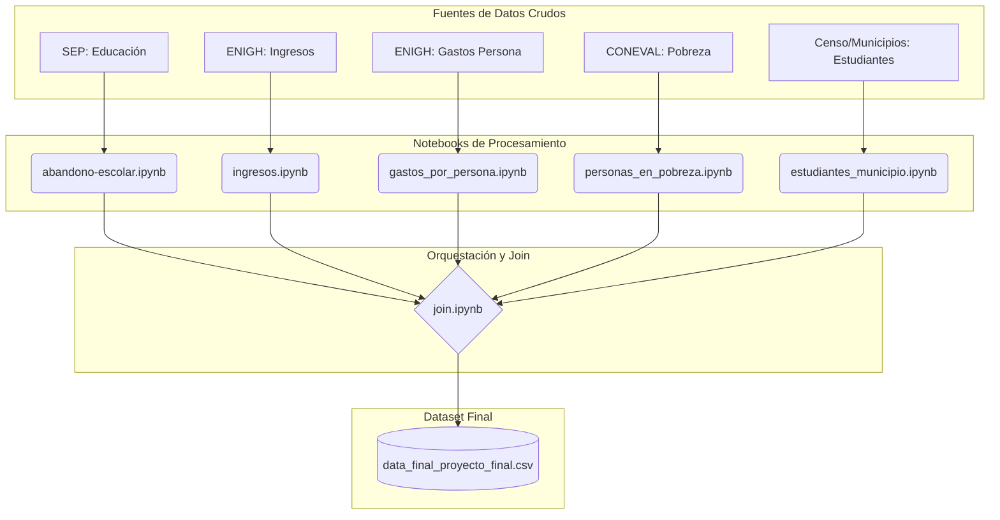

# 📊 Análisis de Factores Socioeconómicos y Deserción Escolar en México


Este repositorio contiene el **pipeline de Ingeniería de Datos y Preprocesamiento** diseñado para integrar, limpiar y estructurar diversas fuentes de información oficial (SEP, INEGI, CONEVAL). El objetivo final es consolidar un *dataset* robusto para el análisis de los factores determinantes en la deserción escolar a nivel superior en México.

---

## 🧾 Descripción General

El proyecto se centra en la normalización y cruce de datos demográficos, económicos y educativos. A través de una serie de *notebooks* modulares, se procesan datos crudos provenientes de diversas entidades federativas y municipios para generar un conjunto de datos maestro (`Master Dataset`) apto para modelado estadístico o algoritmos de Machine Learning.

El flujo de trabajo abarca:
- Limpieza de datos educativos (Tasas de abandono).
- Procesamiento de ingresos y gastos de los hogares (ENIGH).
- Integración de indicadores de pobreza multidimensional (CONEVAL).
- Consolidación demográfica a nivel municipal (Censo 2020).

---

## 🧩 Arquitectura del Flujo de Datos

El siguiente diagrama ilustra el flujo de transformación de los datos, desde las fuentes crudas hasta la generación del archivo final consolidado.


# 📂 Documentación de Módulos de Preprocesamiento

A continuación, se detalla el funcionamiento técnico de cada notebook incluido en el repositorio.

## 1. 🎓 Abandono Escolar (abandono-escolar.ipynb)
Objetivo Estandarizar las tasas de deserción escolar por entidad federativa, enfocándose específicamente en el nivel educativo Superior para el ciclo más reciente disponible.

### Procedimiento

1. Carga de datos históricos de educación por entidad.

2. Imputación de valores faltantes en la columna de Entidad Federativa mediante el método forward fill.

3. Filtrado estricto para aislar registros del nivel "Superior".

4. Selección del ciclo escolar 2023/2024 como variable objetivo.

### Bases de datos utilizadas

educacion_11.xlsx (Datos de la Secretaría de Educación Pública).

### Creación/Eliminación de columnas
Eliminación: Se descartan columnas de ciclos escolares históricos (2000-2023) y niveles educativos básicos (Primaria, Secundaria, Media Superior).

Renombrado: Estandarización de Entidad federativa a NOM_ENT, Nivel educativo a Nivel y 2023/2024 a TASA_ABANDONO.

### Resultados obtenidos

Dataframe limpio con 32 registros correspondientes a las entidades federativas, conteniendo la tasa de abandono porcentual para educación superior (archivo abandono_escolar_nivel_superior_2024.csv).

# 2. 💰 Ingresos Trimestrales (ingresos.ipynb)
Objetivo Calcular el ingreso trimestral promedio ponderado por hogar a nivel estatal, utilizando los factores de expansión proporcionados por la ENIGH.

### Procedimiento

1. Carga del conjunto de datos de ingresos.

2. Cálculo del ingreso ponderado multiplicando el ingreso trimestral (ing_tri) por el factor de expansión (factor).

3. Agrupación de datos por clave de entidad.
4. Mapeo de claves numéricas a nombres de entidades federativas utilizando un diccionario estandarizado.

### Bases de datos utilizadas

conjunto_de_datos_ingresos_enigh2024_ns.csv (Encuesta Nacional de Ingresos y Gastos de los Hogares 2024).

### Creación/Eliminación de columnas
Creación: ing_tri_factor (Producto vectorial de ingreso * factor).

Creación: entidad (Transformación de clave numérica a string mediante mapeo).

### Resultados obtenidos

Archivo ing_tri_por_entidad_2024.csv con la estimación representativa del ingreso trimestral promedio agregado por estado.

### Snippet de Mapeo de Entidades
```
mapa_entidades = {
    1: "Aguascalientes", 2: "Baja California", ... , 32: "Zacatecas"
}
df_ing_tri_por_entidad['entidad'] = df_ing_tri_por_entidad['entidad'].map(mapa_entidades)
```
## 3. 💳 Gastos por Persona (gastos_por_persona.ipynb)
Objetivo Determinar el gasto trimestral promedio por entidad, procesando datos transaccionales detallados y corrigiendo formatos numéricos.

### Procedimiento
1. Ingesta de datos en formato Parquet para optimización de memoria.

2. Limpieza de la variable gasto_tri: eliminación de caracteres especiales (comas) y conversión a tipo numérico.

3. Ponderación del gasto utilizando el factor de expansión poblacional.

4. Agrupación y cálculo de la media por entidad federativa.

### Bases de datos utilizadas
conjunto_de_datos_gastospersona_enigh2024_ns.parquet.

### Creación/Eliminación de columnas

Creación: gasto_tri_factor (Cálculo del gasto ponderado).

Modificación: Renombrado final a GASTO_PROM_TRI para consistencia en el join final.

### Resultados obtenidos

Archivo gasto_promedio_trim_por_entidad_2024.csv con el gasto promedio normalizado por estado.

## 4. 🏘️ Pobreza y Carencias Sociales (personas_en_pobreza.ipynb)
### Objetivo
Extraer indicadores clave de pobreza multidimensional y vulnerabilidad social a nivel municipal, limpiando los encabezados complejos del reporte original de CONEVAL.

### Procedimiento

1. Lectura de archivo Excel con encabezados múltiples (Multi-index).
2. Aplanamiento (Flattening) de nombres de columnas y limpieza de caracteres de control (\n).

3. Selección de variables de interés: Pobreza por carencias, Vulnerabilidad por ingresos, Carencia por acceso a salud y seguridad social.

4. Estandarización de nombres de columnas para facilitar la integración.

### Bases de datos utilizadas

pobreza.xlsx (Datos oficiales CONEVAL 2022).

### Creación/Eliminación de columnas
Eliminación: Se descartan más de 130 columnas con desgloses poblacionales absolutos no requeridos para el análisis porcentual.

Renombrado: Uso de nemónicos técnicos (e.g., POBR_CAR_PROM, VUL_ING_POR) para simplificar la manipulación del dataframe.

### Resultados obtenidos

Dataset personas_en_pobreza.csv a nivel municipal con indicadores normalizados de pobreza y rezago social.

## 5. 🧑‍🎓 Población Estudiantil Municipal (estudiantes_municipio.ipynb)
### Objetivo
Consolidar el conteo de población joven (18-24 años) y estudiantes por municipio, integrando múltiples archivos dispersos y datos censales.

### Procedimiento

1. Búsqueda iterativa y lectura de archivos CSV en el directorio de estudiantes mediante glob.

2. Filtrado de registros con LOC == 0 y NOM_LOC == 'Total del Municipio' para obtener totales municipales correctos.

3. Concatenación de dataframes estatales en un solo dataframe nacional.
4. Enriquecimiento del dataset cruzando con datos del Censo de Población y Vivienda 2020 para obtener la población total (POBTOT).

### Bases de datos utilizadas

Múltiples CSVs en students_by_municipality.

conjunto_de_datos_iter_00CSV20.csv (Censo INEGI).

### Creación/Eliminación de columnas

Eliminación: Registros de localidades específicas (se conservan solo agregados municipales).

### Resultados obtenidos

estudiantes_municipio_todos_los_estados.csv conteniendo POBTOT y P18A24A (Población de 18 a 24 años).

## 6. 🔗 Integración Final (join.ipynb)
### Objetivo
Orquestar la unión (Merge) de todos los datasets preprocesados para generar la tabla analítica final.

### Procedimiento

1. Carga de los 5 datasets procesados anteriormente.

2. Merge 1 (Estudiantes + Ingresos): Unión tipo LEFT JOIN utilizando NOM_ENT como llave.

3. Ingeniería de Características: Cálculo de PROP_POBLACION (Proporción joven) e INGRESO_HOGAR_TRI ajustado por la proporción poblacional.

4. Merge 2 (Gasto): Incorporación del gasto promedio estatal y cálculo de GASTO_MUN_TRI ajustado.
5. Merge 3 (Pobreza): Unión a nivel granular (Entidad + Municipio) e imputación de valores nulos con la media para evitar pérdida de datos.

6. Merge 4 (Abandono): Incorporación de la variable objetivo TASA_ABANDONO.

### Bases de datos utilizadas
Todas las salidas de los notebooks anteriores (processed_data).

### Creación/Eliminación de columnas

Eliminación Final: Se eliminan columnas auxiliares de cálculo (POBTOT, INGRESO_TRI, GASTO_PROM_TRI, etc.) para dejar un dataset limpio y enfocado en variables relativas.

### Resultados obtenidos
data_final_proyecto_final.csv: Matriz final de datos con 2,469 registros municipales y variables explicativas listas para análisis.

## 🧱 Estructura del Repositorio

.
├── data/
│   ├── raw_data/                  # Datos originales (Excel, CSV, Parquet)
│   ├── processed_data/            # CSVs intermedios generados por los notebooks
│   └── data_final_proyecto_final.csv  # DATASET FINAL
├── notebooks/
│   ├── abandono-escolar.ipynb
│   ├── ingresos.ipynb
│   ├── gastos_por_persona.ipynb
│   ├── personas_en_pobreza.ipynb
│   ├── estudiantes_municipio.ipynb
│   └── join.ipynb                 # Orquestador final
└── README.md
## 👥 Equipo de Desarrollo
Este proyecto fue desarrollado manteniendo altos estándares de calidad en el procesamiento de datos por:

**Alanís González Sebástian**

**Fonseca González Bruno**

**Minerva Estrada Montaño Abril**

## 📜 Licencia y Uso
Este proyecto tiene fines académicos y de investigación. Los datos originales pertenecen a sus respectivas fuentes gubernamentales (INEGI, SEP, CONEVAL). El código de preprocesamiento es de uso libre bajo referencia de los autores.